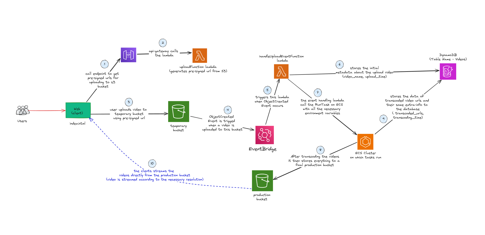

# Video Transcoding Service using AWS

## Introduction

The project aims to build a serverless video transcoding service using AWS. Video transcoding refers to the process of converting video files from one format to another, enabling compatibility with different devices and platforms. The service will be designed to accept video files as input, transcode them into multiple formats, and store the output files in Amazon S3. 

The architecture is designed to be scalable, cost-effective, and highly available, leveraging serverless technologies to minimize operational overhead and infrastructure management.

Things to finish up:

- [ ] Add a detailed guide on setup up the whole system.
- [ ] Cost comparison with existing services.
- [ ] Create fine-grained IAM roles for each service(current one is too broad).

## Table of Contents

1. [Diagram of the Workflow](#diagram-of-the-workflow)
2. [Architecture Overview](#architecture-overview)
3. [Features](#features)
4. [Explaining the folders](#explaining-the-folders)
5. [Acknowledgements](#acknowledgements)

## Diagram of the Workflow 

*The complete diagram of the architecture can be found in the `diagrams` folder.*

## Architecture Overview
The service architecture comprises the following components:

| Service | Description |
| --- | --- |
| **Amazon S3** | Used for storing input and output video files. |
| **AWS Lambda**|Responsible for triggering transcoding tasks and managing the orchestration of the transcoding workflow. |
| **Amazon ECS**|Utilized for executing transcoding jobs in containers, providing scalability and flexibility. |
| **Amazon API Gateway**|Exposes a RESTful API endpoint for interacting with the transcoding service. |
| **Amazon DynamoDB**|Stores metadata related to transcoding jobs for tracking and management purposes. |
| **AWS EventBridge**|Used for triggering transcoding tasks based on predefined events, such as file uploads. |

*A simple HTML frontend then interacts with the API Gateway to submit video transcoding jobs and retrieve the output files.*

## Features
- **Scalability**: Leveraging AWS Lambda, ECS, and S3, the service automatically scales based on demand, ensuring efficient transcoding of video files regardless of the volume.
- **Cost-effectiveness**: By utilizing serverless architecture, the service minimizes operational costs by only paying for the resources consumed during transcoding tasks.
- **Customization**: Users can define their transcoding profiles and presets tailored to their specific requirements, allowing flexibility in the transcoding process.
- **Event-driven**: Integrates with AWS EventBridge for triggering transcoding tasks based on predefined events, such as file uploads to an S3 bucket.
- **Monitoring and Logging**: Utilizes AWS CloudWatch for monitoring and logging, providing insights into the transcoding process and performance metrics.
- **RESTful API**: Exposes a RESTful API via AWS API Gateway for seamless integration with other applications and services.

## Explaining the folders

- **`create-video-table`**: Contains code to create the DynamoDB table to store metadata related to video transcoding jobs using AWS Go SDK.

- **`diagrams`**: Contains the architecture diagram of the video transcoding service.

- **`frontend`**: A simple HTML frontend for uploading and viewing the transcoded video files.

- **`get-video-info-lambda`**: Contains code for the Lambda function that retrieves metadata(*incl urls*) related for a given video ID from the DynamoDB table.

- **`get-videos-lambda`**: Contains code for the Lambda function that retrieves a list of all video IDs and their metadata from the DynamoDB table.

- **`transcoding-image-for-ecs`**: Contains the code and Dockerfile for building a custom container image for transcoding video files using FFmpeg.

- **`upload-event-handle-lambda`**: Contains code for the Lambda function that handles S3 upload events from the EventBridge and triggers the transcoding workflow.

- **`upload-lambda`**: Contains code for the Lambda function that returns a pre-signed URL for uploading video files to an S3 bucket.

## Acknowledgements

- [ffmpeg](https://ffmpeg.org/): used for transcoding video files.
